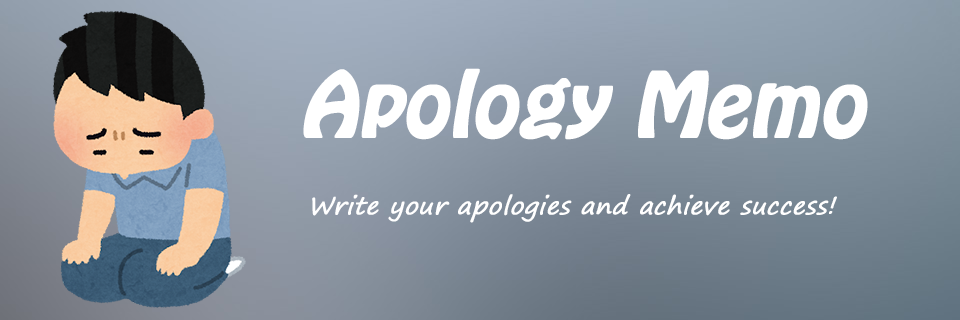
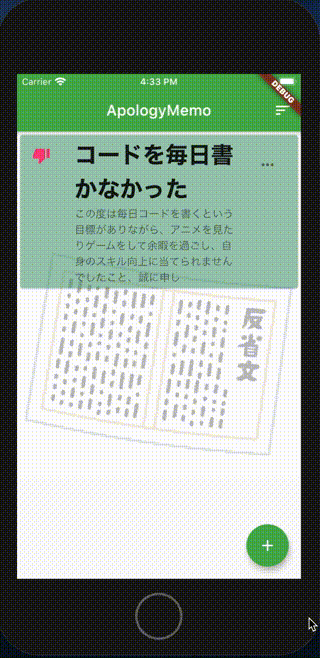
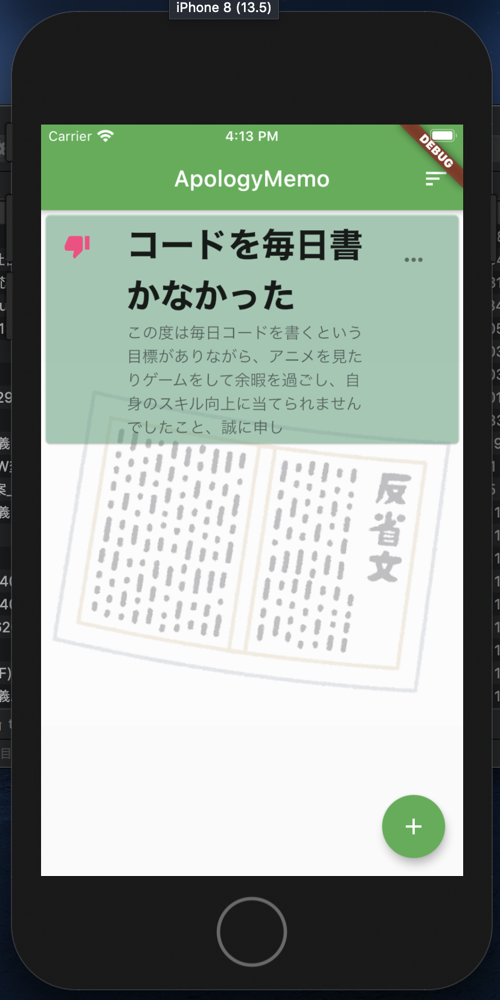
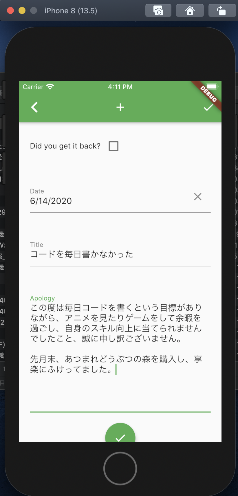

# Apology_memo



Write your apologies and achieve success!

## How about "Apology Memo"

It's hard to keep up with something every day.
The purpose of this app is to help you keep doing something by setting yourself up for the very painful and humiliating task of writing a reflection when you have a hard time keeping up with something every day, or when you can't keep up with it every day.

We've eliminated all unnecessary UI so that you can focus on writing your reflections.

We hope it helps you to keep doing something you're not good at every day.

## Install

### Preconditions

This app uses Flutter. Android or iOS device to create an environment and app that runs Flutter beforehand. Please prepare an emulator.

If you are a Mac user, you can use [provisioning tool named mac-auto-setup](https://github.com/tubone24/mac-auto-setup) to install Flutter.

- Flutter(1.17.2 or more)

### Build APK

```
flutter build apk
```

### Build iOS app

```
flutter build ios
```

## Demo



Listview for apologies.



Editing and creating for apologies.



## Try this app

DeployGate, you can try this app.

